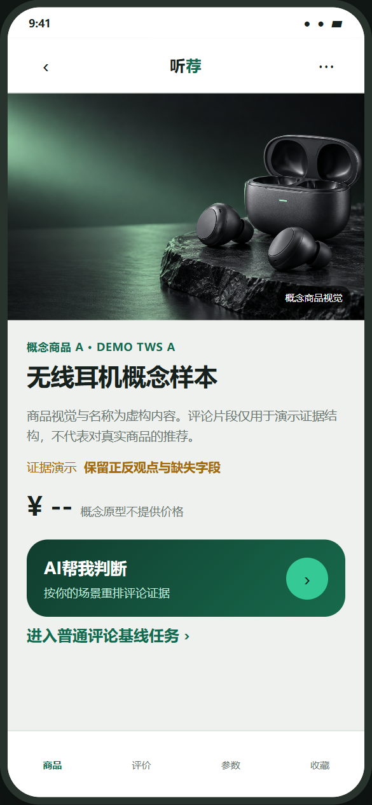
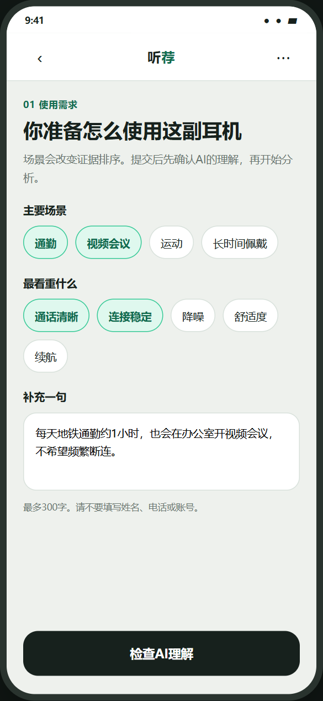
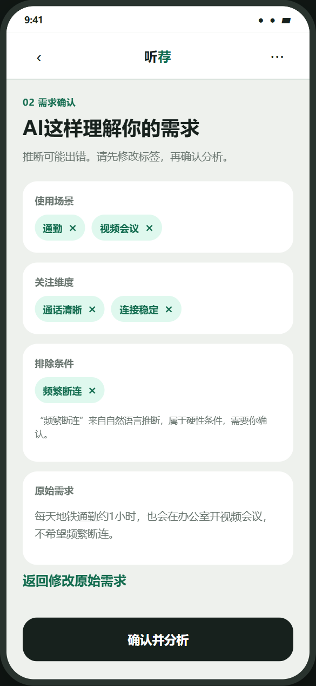
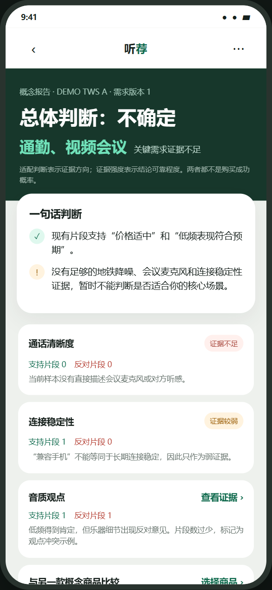
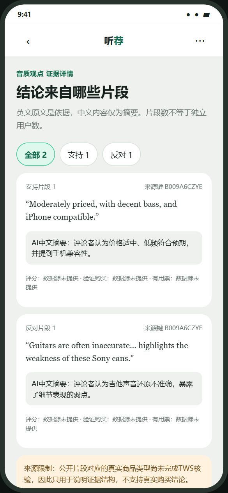
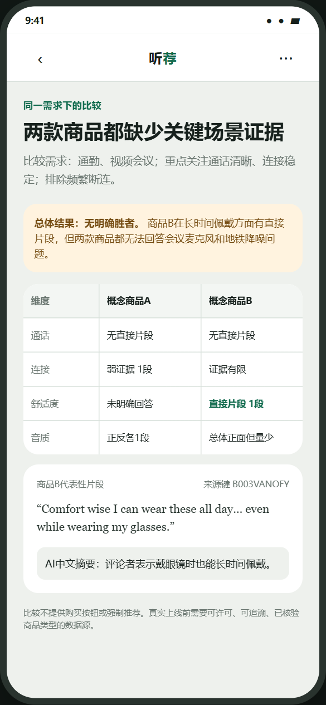

# 听荐 · AI 无线耳机评论决策助手

听荐是一款面向无线耳机选购场景的 AI 决策 Demo。它不只总结“大家觉得好不好”，而是先理解用户的通勤、会议、运动和长时间佩戴需求，再返回与这些需求直接相关的正反评论证据、信息缺口和两款商品比较。

> 个人概念设计，不代表真实公司或电商平台。公开仓库默认使用明确标注的合成演示缓存；本地可以加载不进入Git的匿名真实评论派生数据。项目不会把规则标注、小样本或演示缓存包装成市场结论。

## 为什么做这个项目

商品星级和统一评论摘要会混合不同用户、场景和关注点。对需要地铁降噪的人有价值的评论，不一定能回答会议麦克风是否清楚；“高分”也不意味着不存在连接、舒适度或续航风险。

### 56 份问卷如何影响产品范围

2026 年 9 月完成 56 份匿名需求问卷，其中 35 人属于“过去一年购买过或认真比较过无线耳机”的核心用户。问卷用于发现方向，不代替原型可用性测试。

| 调研信号 | 样本口径 | 对应产品决策 |
|---|---:|---|
| 57.1% 认为“明确需求”或“比较产品”是最难环节 | 核心用户 n=35 | P0 先解析并让用户确认需求；P1 保留同需求商品比较 |
| “信息太多、耗时”和“信息分散”均为 53.1% | Q11 有效 n=32 | 把评论压缩为维度结论，再允许下钻原始证据 |
| 舒适度 80.0%、续航 77.1%、音质 74.3% 居关注项前三 | 核心用户 n=35 | 调整需求输入顺序，不只强调降噪和通话 |
| 38.9% 担心评论来源不清，35.2% 担心总结过度简化 | Q20 有效 n=54 | 强制展示来源、正反证据、证据强度和“不确定”状态 |

73.2% 的全部答卷者表示愿意尝试产品概念，这只是概念兴趣信号，不等于真实使用率、留存或购买转化。样本为便利抽样，且 46 岁以上占 50.0%，政府/公共事业单位从业者与退休人群合计占 62.5%，因此不外推为整体市场结论。

听荐尝试解决三个问题：

1. 用户能否先确认系统如何理解自己的需求；
2. 每项结论能否返回正反原始证据；
3. 证据不足或观点冲突时，系统能否诚实地回答“不确定”。

## 当前可运行能力

- 场景与自然语言需求输入；
- 需求结构化解析及人工确认；
- 降噪、通话、连接、舒适度、续航、音质六维分析；
- “适配方向”和“证据强度”分开展示；
- 支持、反对、混合证据筛选；
- 同一需求下比较两款匿名商品样本；
- 模型超时、无密钥或结果不合规时安全降级；
- 页面显式区分模型来源与数据来源：千问/本地规则、真实评论派生/演示缓存；
- 通过严格HTTP Range安全抽样，服务器不返回206时立即停止，避免误下载22GB文件。

[体验手机端原型](原型设计/index.html) · [完整 PRD](听荐_PRD.pdf) · [可编辑 PRD](docs/听荐_AI无线耳机评论决策助手_产品需求文档_v0.2.docx) · [作品集概述](需求分析概述.pdf) · [问卷分析工作簿](research/听荐_用户需求调研分析_56份.xlsx)

## 界面预览

下列页面对应核心产品流程；当前 v0.2 已将需求、报告、证据和比较页面接入统一 API 层。

<table>
  <tr>
    <td align="center"><br>商品入口</td>
    <td align="center"><br>需求输入</td>
    <td align="center"><br>理解确认</td>
  </tr>
  <tr>
    <td align="center"><br>匹配报告</td>
    <td align="center"><br>证据核验</td>
    <td align="center"><br>同需求比较</td>
  </tr>
</table>

## 产品流程

```text
选择商品
  → 输入使用场景和具体需求
  → 检查并修改系统理解
  → 检索当前商品的相关证据
  → 程序聚合正反观点与证据强度
  → 生成带引用的中文报告
  → 查看原证据或比较两款商品
```

## AI 与程序如何分工

模型并不直接决定商品“好不好”。

- `qwen-flash`：将用户需求解析为场景、关注维度和排除条件；
- 检索与规则层：按商品和维度选择证据，统计支持、反对和混合观点；
- `qwen-plus`：只依据输入的统计和证据生成中文表达；
- 后端校验：拒绝不存在的引用编号，并在异常时返回可追溯模板。

没有 `DASHSCOPE_API_KEY` 时，后端自动运行在 `local_rules` 模式。配置密钥后才会尝试真实千问调用；模型失败不会导致整个演示不可用。更多说明见 [技术架构](docs/architecture.md)。

当前本地验收状态是“匿名真实评论派生证据 + 千问生成报告”。已使用项目所有者的百炼账号完成端到端实调：`qwen-flash` 能解析需求，`qwen-plus` 能基于检索证据生成报告，且报告引用均通过后端追溯校验。它仍是本地可运行 Demo，不等同于已公开上线的生产产品。

## 数据说明

仓库中的 [`data/demo_derived.json`](data/demo_derived.json) 是人工编写的合成演示缓存，包含2个匿名样本、36条证据和六个分析维度。每条内容均带有 `demo_cache`、`synthetic` 和来源声明，不应被写成真实用户研究结果。

2026-09-18 的本地私有验证使用两款同定位匿名真无线耳机：范围请求共传输28 MiB，命中120条评论，清洗后保留106条，并生成207条“评论片段×分析维度”证据。12个“商品×维度”单元均有直接证据。该样本用于验证端到端链路，不具有市场代表性；商品映射、评论派生文件和原始片段均保存在D盘，不提交GitHub。

真实数据管线面向 [Amazon Reviews 2023](https://amazon-reviews-2023.github.io/)：

- 商品元数据与评论通过 `parent_asin` 关联；
- 原始文件、私有商品映射和向量缓存默认保存在 `D:\CodexData\tingjian-ai`；
- GitHub只保留抽样、清洗和验证代码；
- 不保留或展示评论者身份字段；
- `verified_purchase` 和有用票只辅助排序，不被解释为真实性证明；
- 发布任何真实短片段前，仍需核对数据源的最新使用条款。

详见 [数据管线说明](pipeline/README.md)、[轻量范围抽样边界](pipeline/RANGE_SAMPLING.md) 和 [公开演示数据声明](data/README.md)。

## 本地运行

需要 Python 3.11 或更高版本。

```powershell
python -m venv .venv
.\.venv\Scripts\python.exe -m pip install -r backend\requirements.txt
$env:TINGJIAN_AI_MODE = "local"
.\.venv\Scripts\python.exe -m uvicorn backend.app.main:app --host 127.0.0.1 --port 8000
```

保持后端终端运行，再打开一个终端：

```powershell
.\.venv\Scripts\python.exe -m http.server 5500 --bind 127.0.0.1
```

访问 `http://127.0.0.1:5500/`。接口文档位于 `http://127.0.0.1:8000/docs`。

### 加载本地私有真实评论证据

本机运行 `scripts\run_api.ps1` 时，如果存在 `D:\CodexData\tingjian-ai\processed\private_derived.json`，脚本会自动加载；其他电脑没有该文件时会回退到公开合成缓存。也可以显式指定：

```powershell
.\scripts\run_api.ps1 -Mode local `
  -DataPath 'D:\CodexData\tingjian-ai\processed\private_derived.json'
```

页面会显示“真实评论派生证据 · 本地规则报告”，不会把本地规则误写成实时AI。

### 切换真实千问接口

API Key只能配置在后端进程中，不能写入前端、文件或提交Git。推荐使用隐藏输入脚本，Key不会显示也不会进入命令历史：

```powershell
.\scripts\run_api_qwen_window.ps1
```

该脚本会先做环境预检，再隐藏输入 Key，并把后端留在本机后台运行。需要在当前终端前台运行时，也可以使用 `scripts\run_api_qwen.ps1`。不要把真实 Key 粘贴到聊天、README、截图或前端代码中。

`run_api_qwen_window.ps1` 使用本机 D 盘的私有派生数据路径，适合项目所有者本机验收。其他设备首次克隆仓库时，可以先运行 `scripts\run_api.ps1`，使用仓库内明确标注的合成演示缓存。

当前代码默认使用 `qwen-flash`解析需求、`qwen-plus`生成报告。未配置密钥时，页面会分别说明：当前使用本地规则，以及证据来自私有真实评论派生数据还是公开演示缓存。

## API

- `GET /api/health`：运行模式与已加载证据状态；
- `POST /api/needs/parse`：解析用户需求；
- `POST /api/reports`：生成单商品报告；
- `GET /api/products/{product_id}/evidence`：按维度和倾向读取证据；
- `POST /api/compare`：在同一需求下比较两款商品。

请求和响应使用严格 Pydantic 结构，多余字段会被拒绝。前端不接触模型密钥。

## 验证状态

截至当前版本：

- 需求问卷：完成 56 份匿名答卷分析，其中核心用户 35 人；已记录分母差异、便利抽样和样本结构限制；
- 自动化测试：10项通过，其中后端测试覆盖20条需求解析基线和30份报告引用追溯；
- 公开演示缓存验证：2个商品、36条合成证据、12个“商品×维度”组合完整覆盖；
- 私有真实数据验证：120条抽样、106条清洗后评论、207条规则派生证据，12个“商品×维度”单元均有直接证据；
- 浏览器冒烟测试：合成降级与私有真实数据两种模式均走通需求、报告、证据和商品比较；
- 千问实调：本机 `qwen` 模式健康检查通过；一条复合需求完成解析和报告生成，6条模型引用全部可回溯到输入证据；
- 人工页面验收：真实完成“输入需求 → 生成报告 → 查看证据”流程；
- 尚未完成：20条真实模型需求复测、30份真实模型报告审计、30条规则标签人工复核、3–5名真人可用性测试。未提前填写理解率或效率提升。

```powershell
.\.venv\Scripts\python.exe -m pytest backend\tests -q
.\.venv\Scripts\python.exe pipeline\validate_public_data.py
.\.venv\Scripts\python.exe -m unittest tests.test_public_demo_data
.\.venv\Scripts\python.exe -m pytest tests\test_range_sampler.py -q
```

完整测试设计见 [MVP验证计划](docs/evaluation-plan.md) 和 [第一轮任务型用户测试执行包](research/usability-test/第一轮任务型用户测试执行包.md)。求职讲解与学习顺序见 [项目学习指南](docs/求职讲解与项目学习指南.md)。

## 用户需求调研

项目已完成第一轮匿名需求问卷，共回收 56 份完整答卷。研究过程先了解用户真实选购流程和痛点，再介绍听荐概念并收集功能与信任偏好；它回答“问题是否值得解决”，不回答“原型是否已经好用”。

- [查看调研结论、样本限制与产品决策](research/README.md)
- [查看脱敏汇总分析工作簿](research/听荐_用户需求调研分析_56份.xlsx)
- [查看问卷文本](research/听荐_无线耳机用户需求调研_问卷星文本导入版.txt)
- 问卷未主动收集姓名、手机号、学校或公司名称；问卷星原始导出可能包含平台自动记录字段，因此仅保存在本地 `research/private/`，并由 Git 忽略

全部比例均标注实际分母；不同题目因跳题和有效回答数不同，不使用统一分母。结果只作为需求发现和 MVP 排序依据，不宣称代表整体无线耳机市场，也不把“愿意尝试”写成真实采用率。

## 项目结构

```text
.
├─ 原型设计/             手机端网页与API客户端
├─ backend/              FastAPI、模型调用、规则与严格数据结构
├─ pipeline/             真实评论候选筛选、抽样、清洗和数据验证
├─ data/                 明确标注的合成演示缓存与数据声明
├─ tests/                公开数据与浏览器流程验证
├─ docs/                 技术架构、评估计划与可编辑 PRD
├─ research/             问卷文本、脱敏汇总分析与研究口径说明
├─ 听荐_PRD.pdf          22 页产品需求文档 v0.2
└─ 需求分析概述.pdf      12 页作品集概述 v0.2
```

## 下一步

1. 邀请 3–5 名此前不了解听荐的用户完成基线评论浏览与原型任务测试，记录完成时间、理解情况和关键原话；
2. 使用真实模型复测 20 条需求和 30 份引用报告，记录成功率、降级率和引用错误；
3. 人工复核至少 30 条主题/倾向标签，记录规则误判并迭代标注方法；
4. 根据任务测试结果迭代一次交互，再评估国内公开部署和 60–90 秒演示视频。

本项目的核心不是强制给出推荐，而是让用户知道：系统理解了什么、证据支持什么，以及哪些问题仍然无法回答。
